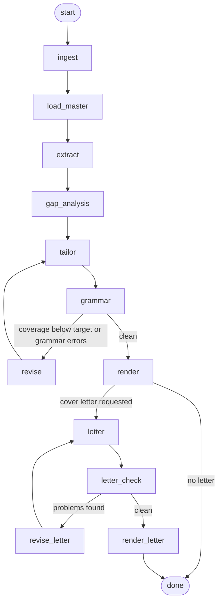

# resume-tailor

[](https://github.com/Dynodee/resume-tailor/actions/workflows/tests.yml)

Paste a job link. Get back a tailored, proofread, ATS-safe PDF, a cover letter
in your own voice, and an honest account of every requirement in the posting.

```
resume-tailor import my_resume.pdf                 # once: turn your resume into a fact base
resume-tailor style add my_old_cover_letter.pdf    # once: learn how you write
resume-tailor https://boards.greenhouse.io/acme/jobs/1234567 --interview --letter
```

```
ingest: greenhouse | 6418 chars | 7 section(s) | title=Analytics Engineer
master: loaded 3 role(s), 2 project(s), 29 skills
extract: 24 terms (18 from lexicon, 6 new from model) | required=11 preferred=9 mentioned=4
gaps: reviewer rejected 1 reframe(s) as overstated -- treated as related experience instead
interview: 1 placed, 1 skipped -- saved to master_resume.confirmed.yaml
gaps: 5 requirement(s) not stated in your fact base -- 1 adjacent, 1 ask, 1 confirmed, 2 reframe
tailor: revision 0 -- 15 bullets
tailor: coverage 88.4% overall, 100.0% of the required terms your fact base supports
grammar: 0 issue(s) remain (3 resolved this pass)
render: JORDAN_RIVERA_Acme_Analytics_Engineer.pdf (1 page)
letter: draft 0 -- 4 paragraph(s), 286 words
letter check: 1 issue(s)
revise letter: pass 1 because of style-sentence-length
render letter: JORDAN_RIVERA_Acme_Analytics_Engineer_Cover_Letter.pdf, text copy at JORDAN_RIVERA_Acme_Analytics_Engineer_Cover_Letter.txt

Requirements  14 requirements: 12 on the page, 1 related experience, 1 not yet placed
Related experience (covered in a cover letter): Looker
Not yet placed: Kubernetes
```

---

## The graph



| node | what it does |
| --- | --- |
| `ingest` | Fetches the posting. Uses the vendor JSON API for Greenhouse, Lever, Ashby and Workday; falls back to JSON-LD `JobPosting` markup, then to tag-stripping. Splits the text under its own headings. |
| `load_master` | Loads your fact base, merges in skills you placed in interview mode, and loads the keyword lists for your field. |
| `extract` | Finds the ATS terms. A lexicon with alias tables does the exact matching (the built-in list plus any packs for your field); the model adds whatever the dictionary has never heard of. Priority comes from *which section* a term sat in, not from the model's opinion. Also collects the posting's *exact phrases* (see below). |
| `gap_analysis` | For every required or preferred term your fact base does not state in so many words, decides: **reframe**, **adjacent**, **ask** or **gap** (see below). A second, skeptical pass reviews every reframe. In `--interview` mode, asks where on your resume each of the rest belongs. |
| `tailor` | Reads what the role actually does, re-leads each kept bullet with the part that matters for it, then fits the posting's vocabulary where it reads naturally -- constrained to the fact base. |
| `grammar` | Rule checks (including keyword-stuffing tells), then a copy-edit pass, then applies the edits and re-checks. |
| `revise` | Loops back to `tailor` with the specific gaps and errors, at most `--max-revisions` times. |
| `render` | Writes the PDF, a plain-text twin, and the change report. |
| `letter` | With `--letter`: writes a cover letter in your voice, every claim citing a fact. |
| `letter_check` | Deterministic checks: invented numbers, copied sentences, details from old letters, drift from your measured style, length, stock phrases. |
| `revise_letter` | Loops back to `letter` with what the checker found, at most twice. |
| `render_letter` | Writes the letter PDF and a text copy for pasting into application forms. |

The revision edges are the point of the design: results decide whether a step
runs again, and every loop is bounded so it always terminates.

---

## Install

```bash
git clone https://github.com/<you>/resume-tailor.git && cd resume-tailor
python -m venv .venv && source .venv/bin/activate   # Windows: .venv\Scripts\Activate.ps1
pip install -e ".[graph,dev]"

cp .env.example .env                                 # then paste your key into .env
```

`[graph]` pulls in LangGraph. Without it the same graph runs on a small built-in
executor -- the test suite asserts both produce identical output.

Optional, for pulling the resume from Google Drive: `pip install -e ".[drive]"`.

---

## Start with your own resume

```bash
resume-tailor import my_resume.pdf            # PDF, DOCX, TXT or MD
```

The model reads the file (a PDF goes in as a PDF, so multi-column templates
survive) and writes `data/master_resume.yaml`: every role, bullet, project,
skill, degree and certification, plus the parts you would otherwise write by
hand -- keyword hints for each bullet, headline options, and a starter
`do_not_claim` list ("degree in progress, not completed").

The fact base is the only thing the tool may ever claim about you, so the import
is checked against your original before it is saved:

- **every bullet and summary fact must be in the original** -- word for word or
  nearly, with every number present. Anything that fails is parked under
  `unverified:`, which nothing reads until you move it.
- **keyword hints must be grounded in their bullet.** Hints count as evidence,
  so a hint naming a skill the bullet never mentions is dropped.
- **contact details must appear in the original.** A guessed email is cleared.

Read the file once. Then add true facts that are not on your resume yet: the
tailor can only use what is here, and a fact you leave out is a gap it cannot
close.

Without an API key, import falls back to a rule-based parser (weaker on unusual
layouts, same checks). `--force` replaces an existing fact base.

### Profiles

Tailoring for more than one person? Give each a profile:

```bash
resume-tailor import jane_resume.pdf --profile jane
resume-tailor style add jane_letter.docx --profile jane
resume-tailor <url> --profile jane
```

Each profile keeps everything in `profiles/<name>/` (fact base, writing
samples, style, learned terms) and writes to `out/<name>/`. `RT_PROFILE=jane`
in `.env` makes one the default. Without a profile, the same files live in
`data/`.

---

## Use

```bash
# from a URL
resume-tailor https://jobs.lever.co/acme/1a2b3c4d

# when the page is JavaScript-rendered and the fetch comes back thin
resume-tailor --text "$(pbpaste)"
resume-tailor --text-file jd.txt

# place requirements your fact base does not show onto your resume
resume-tailor <url> --interview

# also write a cover letter in your voice
resume-tailor <url> --letter

# see what the screen is looking for, without building anything
resume-tailor <url> --keywords-only

# force it onto one page
resume-tailor <url> --max-pages 1

# no API key, no network calls to a model
resume-tailor --text-file jd.txt --offline
```

Every run writes to `out/`:

| file | what it's for |
| --- | --- |
| `<name>.pdf` | the resume |
| `<name>.txt` | what an ATS parser should read out of the PDF -- check it before sending |
| `<name>_changes.md` | what tailoring did: every bullet before and after, the keywords each edit picked up, what was left out, and **every requirement, accounted for** |
| `<name>_Cover_Letter.pdf` / `.txt` | with `--letter` |

The posting's terms are **bolded** in the summary and bullets, for the recruiter
skimming after the screen (at most two per bullet, each term once per role,
never the skills list). `--no-bold` turns it off.

Useful flags: `--target 85` (required-coverage bar), `--max-revisions 3`,
`--model`, `--effort`, `--out`, `--master`, `--resume`, `--graph`.

---

## Closing gaps honestly

Most of what looks like a gap is not one: you have done the thing and described
it differently. A posting asks for "CI/CD"; your bullet says you set up tests
that run on every merge. Literal matching calls that missing. `gap_analysis`
sorts every such term into one of four outcomes:

| outcome | meaning | what happens |
| --- | --- | --- |
| **reframe** | a bullet shows this skill in other words | the posting's term may go on the page -- on the cited bullets only |
| **adjacent** | related, not the same (Tableau vs. Power BI) | the bullet stresses what transfers; the cover letter names the difference |
| **ask** | plausible, but not in your fact base | open -- place it with `--interview` |
| **gap** | nothing backs it | a cover-letter or interview topic |

Reframe is the risky call, so it has guards:

- a **second, independent review** of every reframe, asking only "does this
  bullet, as written, show this skill?". A rejected reframe becomes adjacent.
- seniority, years, degrees, licenses, certifications and named tools never
  reframe; anything on your `do_not_claim` list is a gap before the model sees it.
- after tailoring, a reframed term on any bullet other than the cited ones
  sends that bullet back to its fact-base wording, and one in the summary or
  headline is flagged for you.

**Interview mode** (`--interview`) asks one question per open item -- where on
your resume it belongs:

```
? Looker (posting: "Experience with Looker or similar BI tools") -- where on your resume does this belong?
  1. Senior Business Analyst - Northwind Retail Group
  2. Tableau Analyst - Harbor Beverage Distributors
  3. Tax Auditor / Business Analyst - State Department of Revenue
  4. Multi-Agent Research System - Python, LangGraph, MCP, FastAPI
  5. LLM-Assisted Analysis of 12.4M+ Retail Transactions - Independent Project
  0. Skills section only
  Enter to skip > 2
```

Picking a role or project is the yes: the tool writes a bullet there that
connects the skill to what that role's existing bullets already say. It may not
add a number or a name the role does not already contain -- if the model tries,
a plain "Applied Looker in day-to-day work." is used instead. `0` adds the term
to an "Additional Skills" group. Enter, or anything that is not a listed
number, skips it.

Everything you place is saved to `master_resume.confirmed.yaml` beside your
fact base, so it is there on every later run -- open it and edit each bullet to
say what you actually did. Your hand-edited fact base is never rewritten.

Each placed skill becomes a claim on your resume, so skip anything you have not
done: a listed skill gets asked about at the phone screen, and a reference or
background check can cost you the offer.

The change report lists every required and preferred term with its outcome --
on the page, rephrased from which bullet, placed by you, related experience,
not yet placed, or a true gap -- so nothing the posting asks for goes
unaddressed.

---

## Cover letters in your voice

```bash
resume-tailor style add letter_for_acme.pdf letter_for_globex.docx
resume-tailor style show
resume-tailor <url> --letter
```

`style add` keeps your letters (as text) and builds `style.yaml`:

- **measured** -- sentence length, contractions, how often a sentence starts
  with "I", exclamation marks, dashes. Counted in plain Python, so the checker
  can compare a draft against them.
- **described** -- tone, how you open and close, how you talk about your work,
  phrases you actually use (each verified to be in a sample), habits you don't
  have.

With `--letter`, the writer gets your real letters as examples (a description
of a voice alone tends to come out generic), your style notes, the fact list,
the tailored resume, and the gap analysis -- which says what to show, what to
call related experience, and which gaps never to claim. Your samples and fact
list go first in the prompt and are cached, so revisions cost a fraction of the
first draft.

Every claim in the letter cites a fact id. The checker then looks for:

| check | catches |
| --- | --- |
| fact ids and numbers | a citation to a fact that doesn't exist; a number not in your fact base or the posting |
| copied passages | eight or more words in a row from one of your old letters |
| old-letter details | an employer or name from a sample that has nothing to do with this job |
| claim overreach | a claim about a gap or adjacent skill resting on a fact that doesn't mention it |
| style distance | sentence length, contractions, exclamation marks, "I"-starts drifting from yours |
| stock phrases | "passionate about", "perfect fit"... -- only if your own letters never use them |
| basics | length near your usual, the company named, no `[placeholders]` |

Findings go back to the writer for up to two revisions.

---

## Two kinds of coverage

**Keyword coverage** asks whether a skill is on the page in *any* wording --
"dbt" counts for "data build tool". That is what an ATS's skill-matching
engine does.

**Exact-phrase coverage** asks whether the posting's *own words* are on the page.
That is what a recruiter typing "Data Build Tool" into the search box gets.
Matching is case-insensitive, treats hyphens as spaces, and allows a plural;
nothing looser.

| bucket | meaning |
| --- | --- |
| word for word | the phrase is on the page |
| in other words only | the skill is there, the posting's wording is not -- fixable |
| supported but missing | your fact base backs it, the page does not mention it |
| not in your fact base | nothing backs it -- see *Closing gaps honestly* |

The tailor closes "in other words" gaps without new claims, least intrusive
first: a skills-group label, a skill item written with the posting's name
("dbt (Data Build Tool)" -- only when the lexicon says both name the same
thing), the headline, then a bullet where it reads naturally.

### Keyword lists for your field

The built-in lexicon is tech, data and BI. Packs in
`src/resume_tailor/ats/lexicons/` cover other fields:
`healthcare`, `finance`, `marketing`, `sales`, `operations`, `people` (HR).
Import picks the packs your resume's vocabulary matches and writes them to the
fact base as `lexicon_packs: [...]`; edit the list freely. Terms the model finds
in real postings that no list knew are saved to `lexicon.yaml` next to your fact
base and matched exactly from then on. A pack is a short YAML file -- adding one
for your field is easy.

---

## The fact base

`data/master_resume.yaml` (or `profiles/<name>/fact_base.yaml`) is the only
thing the tailor may draw from: every role, bullet, project, skill and degree,
each bullet with keyword hints, plus `do_not_claim` -- things that are
specifically *not* true. Optional fields:

| field | what it does |
| --- | --- |
| `projects_heading`, `experience_heading` | section headings (default "PROJECTS", "WORK EXPERIENCE") |
| `extra_sections` | licenses, volunteering, awards, publications -- shown exactly as written |
| `lexicon_packs` | keyword lists for your field |
| `unverified` | written by import; never read by anything until you move items out |

Three mechanisms keep the output honest, because the expensive failure of a tool
like this is not a missed keyword -- it is a fluent sentence about something you
have never done, which you then have to defend in an interview:

1. **Traceability.** Every bullet the model emits carries the `source_id` of the
   fact it came from. Anything that does not resolve is dropped.
2. **A closed skills list.** The skills section can only contain strings in the
   fact base. Group labels are checked too, including against reframed terms.
3. **A fabrication audit.** Proper nouns in the output -- resume and letter --
   are checked against the fact base (and the posting, for the letter); anything
   new is surfaced for you to look at.

Keep the fact base a superset. A true fact you would not put on every resume
costs nothing and gives the tailor something to reach for when it matters.

### Refreshing from Google Drive

`--resume <file id or URL>` pulls a Google Doc, `.docx` or PDF, parses it back
into the fact-base shape, and merges it over the YAML. Curated metadata --
`do_not_claim`, keyword hints, headline `fits` -- always wins. First run needs a
Google OAuth **desktop** client saved as `credentials.json`; read-only scope.

---

## Models, effort and cost

The default model is `claude-opus-5-5` (`RT_MODEL` or `--model` to change it).
Each step asks for the depth it needs: keyword extraction thinks briefly;
tailoring, gap analysis and the letter think hardest. `--effort low` (or
`RT_EFFORT=low`) overrides every step at once for a cheaper, faster run.

Replies the code parses are schema-checked by the API (structured outputs), so
there is no JSON-fishing on the models that support it. On models that support
it, a safety decline is retried server-side on another model rather than
failing the run; `RT_FALLBACKS=0` turns that off.

---

## Why the PDF looks plain

Every choice in `render/pdf.py` is a parser accommodation: one column and one
text flow; no tables (dates go on their own line); nothing in the margins; and
standard fonts with real text. The `.txt` twin is the extraction check -- if it
reads correctly, the PDF will parse correctly. Read it before you send anything.

---

## Offline mode

With no `ANTHROPIC_API_KEY` (or with `--offline`) the whole graph still runs:
bullets are selected and reordered by keyword overlap but not rewritten, open
requirements become questions, and the cover letter is skipped (a voice cannot
be imitated without the model). It exists so the pipeline is testable in CI
without a key, and so that when a run goes wrong you can tell whether the bug
was in the orchestration or in the model output.

---

## Keeping secrets and personal data out of the repo

- **API key.** Read from `.env` or the environment, never from code. `.env` is
  gitignored, `Config` hides the key from its repr, and a test fails the build
  if anything that looks like an Anthropic key is ever committed.
- **Your data.** `data/master_resume.yaml`, skills placed in interview mode
  (`*.confirmed.yaml`), writing samples, `style.yaml`, learned terms, the whole
  `profiles/` folder and everything in `out/` are gitignored, and a test fails
  the build if any of them is ever tracked. The test suite runs on the fictional
  example and never reads your files.
- **Google credentials.** `credentials.json` and `token.json` are gitignored.

---

## Tests

```bash
pytest
```

About 150 tests, no API key needed. They cover lexicon matching and packs,
posting parsing, import and its checks against the original, keyword and
exact-phrase coverage, gap sorting and the reframe guards, interview mode,
every linter and letter check, the style measurements, fact-base traceability,
bolding, the request shapes sent to the API, and repository hygiene -- plus
end-to-end runs through both graph executors, and regression tests that replay a
real model output against a public job posting through a scripted stand-in for
the model.
