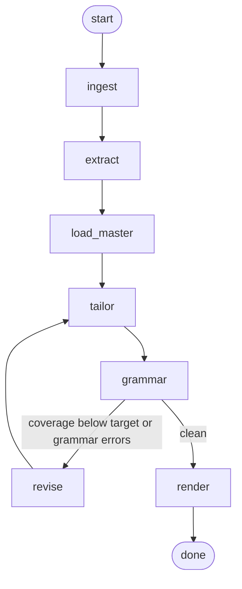

# resume-tailor

[](https://github.com/Dynodee/resume-tailor/actions/workflows/tests.yml)

Paste a job link. Get back a tailored, proofread, ATS-safe PDF — plus an honest
list of the gaps it could not close.

```
resume-tailor https://boards.greenhouse.io/acme/jobs/1234567
```

```
ingest: greenhouse | 6418 chars | 7 section(s) | title=Agentic AI Engineer II
extract: 24 terms (18 from lexicon, 6 new from model) | required=11 preferred=9 mentioned=4
master: loaded 3 role(s), 2 project(s), 29 skills
tailor: revision 0 -- 16 bullets
tailor: coverage 82.8% overall, 90.7% on required terms
grammar: 3 mechanical fix(es), 4 issue(s) from the rule checks
grammar: applied 4 copy edit(s) from the review pass
grammar: 0 issue(s) remain (4 resolved this pass)
render: JORDAN_RIVERA_Acme_Agentic_AI_Engineer_II.pdf (1 page)

Coverage  overall 82.8%  |  required 90.7%
Still missing (required): CI/CD
These are the gaps to address in a cover letter or interview, not to invent on the page.

PDF /path/to/out/JORDAN_RIVERA_Acme_Agentic_AI_Engineer_II.pdf
```

---

## The graph



| node | what it does |
| --- | --- |
| `ingest` | Fetches the posting. Uses the vendor JSON API for Greenhouse, Lever, Ashby and Workday; falls back to JSON-LD `JobPosting` markup, then to tag-stripping. Splits the text under its own headings. |
| `extract` | Finds the ATS terms. A ~150-entry lexicon with alias tables does the exact matching; the model adds whatever the dictionary has never heard of. Priority comes from *which section* a term sat in, not from the model's opinion. |
| `extract` (phrases) | Also collects *exact phrases*: every tag in the posting's skills list (Workday, LinkedIn) plus the posting's own wording of each required skill. These are scored literally -- see below. |
| `load_master` | Loads the fact base — the YAML, optionally refreshed from a Google Drive doc. |
| `tailor` | Reads what the role actually does, re-leads each kept bullet with the part that matters for it, then fits the posting's vocabulary where it reads naturally -- constrained to the fact base. Work experience leads unless your projects carry the match. |
| `grammar` | Rule checks (including keyword-stuffing tells: parenthetical glosses, name-dropped soft skills, a summary over 45 words), then a copy-edit pass, then applies the edits and re-checks. |
| `revise` | Loops back to `tailor` with the specific gaps and errors, at most `--max-revisions` times. |
| `render` | Writes the PDF and a plain-text twin. |

The revision edge is the only branch, and it is the point of the whole design:
coverage and grammar results decide whether the tailoring runs again, and the
loop is bounded so it always terminates.

---

## Install

```bash
git clone https://github.com/<you>/resume-tailor.git && cd resume-tailor
python -m venv .venv && source .venv/bin/activate   # Windows: .venv\Scripts\Activate.ps1
pip install -e ".[graph,dev]"

cp .env.example .env                                     # then paste your key into .env
cp data/master_resume.example.yaml data/master_resume.yaml   # then make it yours
```

Both `.env` and `data/master_resume.yaml` are gitignored. Until you create your
own fact base the tool runs on the shipped example -- a fictional analyst,
Jordan Rivera -- and says so on every run.

`[graph]` pulls in LangGraph. Without it the same graph runs on a small built-in
executor — the test suite asserts both produce identical output.

Optional, for pulling the resume from Google Drive:

```bash
pip install -e ".[drive]"
```

---

## Use

```bash
# from a URL
resume-tailor https://jobs.lever.co/acme/1a2b3c4d

# when the page is JavaScript-rendered and the fetch comes back thin
resume-tailor --text "$(pbpaste)"
resume-tailor --text-file jd.txt

# see what the screen is looking for, without building anything
resume-tailor <url> --keywords-only

# refresh the fact base from the Google Doc you actually edit
resume-tailor <url> --resume <google-drive-file-id>

# force it onto one page
resume-tailor <url> --max-pages 1

# no API key, no network calls to a model
resume-tailor --text-file jd.txt --offline
```

Every run writes three files to `out/`:

| file | what it's for |
| --- | --- |
| `<name>.pdf` | the resume |
| `<name>.txt` | what an ATS parser should read out of the PDF -- check it before sending |
| `<name>_changes.md` | what tailoring did: every bullet before and after, the keywords each edit picked up, what was left out, and the posting's required terms your fact base cannot support |

The posting's terms are **bolded** in the summary and bullets, for the recruiter
skimming after the screen. The ATS reads the text layer and ignores font weight,
so bold can't help or hurt parsing. Bold is kept sparse:

- at most two terms per bullet and three in the summary
- each term once per role
- required terms first
- never the skills list or headings

The changes file lists what was bolded, and `--no-bold` turns it off.

Useful flags: `--target 85` (required-coverage bar the revision loop steers on),
`--max-revisions 3`, `--model`, `--out`, `--master`, `--graph`.

---

## Two kinds of coverage

**Keyword coverage** asks whether a skill is on the page in *any* wording --
"dbt" counts for "data build tool". That is what an ATS's skill-matching
engine does.

**Exact-phrase coverage** asks whether the posting's *own words* are on the page.
That is what a recruiter typing "Data Build Tool" into the search box gets, and
many searches do not know the two are the same tool. Matching is
case-insensitive, treats hyphens as spaces, and allows a plural; nothing looser.

Each phrase lands in one of four buckets, listed in the `_changes.md` file:

| bucket | meaning |
| --- | --- |
| word for word | the phrase is on the page |
| in other words only | the skill is there, the posting's wording is not -- fixable |
| supported but missing | your fact base backs it, the page does not mention it |
| not in your fact base | nothing backs it; add it to the YAML if true, otherwise leave it off |

The tailor closes "in other words" gaps without new claims, least intrusive
first: a skills-group label ("Data Visualization & BI"), a skill item written
with the posting's name ("dbt (Data Build Tool)" -- allowed only when the
lexicon says both name the same thing), the headline, then a bullet where it
reads naturally. Soft-skill phrases are listed but never scored. Coverage below
`--phrase-target` (default 70%) triggers a revision pass.

## The fact base

`data/master_resume.yaml` is the only thing the tailor node is allowed to draw
from. It holds every role, bullet, project, skill and degree, each with keyword
hints, plus a `do_not_claim` list of things that are specifically *not* true.

Three mechanisms keep the output honest, because the expensive failure of a tool
like this is not a missed keyword — it is a fluent sentence about something you
have never done, which you then have to defend in an interview:

1. **Traceability.** Every bullet the model emits carries the `source_id` of the
   fact it came from. Anything that does not resolve to a real id is dropped
   before the document is assembled, not flagged for later.
2. **A closed skills list.** The skills section can only contain strings that
   appear in the fact base. An invented one is discarded and reported.
3. **A fabrication audit.** After assembly, proper nouns in the output are
   checked against the fact base and anything new is surfaced as a warning for
   you to look at. Blunt on purpose — it produces warnings for a human, never
   automatic edits.

Missing terms stay missing. The CLI prints them as gaps for a cover letter or an
interview rather than working them onto the page.

Keep the YAML a superset. Adding a true fact you would not put on every resume
costs nothing and gives the tailor something to reach for on the posting where
it matters.

### Refreshing from Google Drive

`--resume <file id or URL>` pulls a Google Doc, `.docx` or PDF, parses it back
into the fact-base shape, and merges it over the YAML. Curated metadata —
`do_not_claim`, the per-bullet keyword hints, the headline `fits` tags — always
wins, because a rendered document cannot express any of it.

First run needs a Google OAuth **desktop** client: create one in Google Cloud
Console, download it as `credentials.json` next to the repo, and the first run
opens a browser once and caches `token.json`. Read-only scope.

---

## Why the PDF looks plain

Every choice in `render/pdf.py` is a parser accommodation:

- **One column, one text flow.** Multi-column layouts and text boxes get read in
  the wrong order, which scrambles your dates into your skills.
- **No tables.** Right-aligned dates are normally a table or a tab stop, and
  both parse unreliably. Dates go on their own line instead.
- **Nothing in the margins.** Headers and footers are commonly dropped — that is
  how people lose their phone number.
- **Standard fonts, real text.** The parser reads the text layer; vectorised
  glyphs leave nothing to read.

Every run also writes a `.txt` twin next to the PDF. That is the extraction
check: it is what a parser should come away with, so if it reads correctly, the
PDF will parse correctly. Read it before you send anything.

---

## Offline mode

With no `ANTHROPIC_API_KEY` (or with `--offline`) the whole graph still runs.
Bullets are selected and reordered by keyword overlap but not rewritten, so the
output is weaker — and completely honest, since nothing is generated. It exists
so the pipeline is testable in CI without a key, and so that when a run goes
wrong you can tell immediately whether the bug was in the orchestration or in
the model output.

---

## Keeping secrets and personal data out of the repo

- **API key.** Read from `.env` or the environment, never from code. `.env` is
  gitignored, `Config` hides the key from its repr so it cannot leak into a log,
  and a test fails the build if anything that looks like an Anthropic key is
  ever committed.
- **Your resume.** `data/master_resume.yaml` and everything in `out/` (tailored
  PDFs, change reports) are gitignored. The test suite runs on the fictional
  example and never reads your file.
- **Google credentials.** `credentials.json` and `token.json` are gitignored.

Before a push, `git status` should never list `.env`, `data/master_resume.yaml`
or anything under `out/`.

---

## Tests

```bash
pytest
```

About 90 tests, no API key needed. They cover lexicon matching and its boundary
cases, posting parsing, keyword and exact-phrase coverage, every linter rule,
fact-base traceability, bolding, and repository hygiene. They also include
end-to-end runs through both graph executors, plus regression tests that replay a
real model output against a public job posting through a scripted stand-in for
the model.
